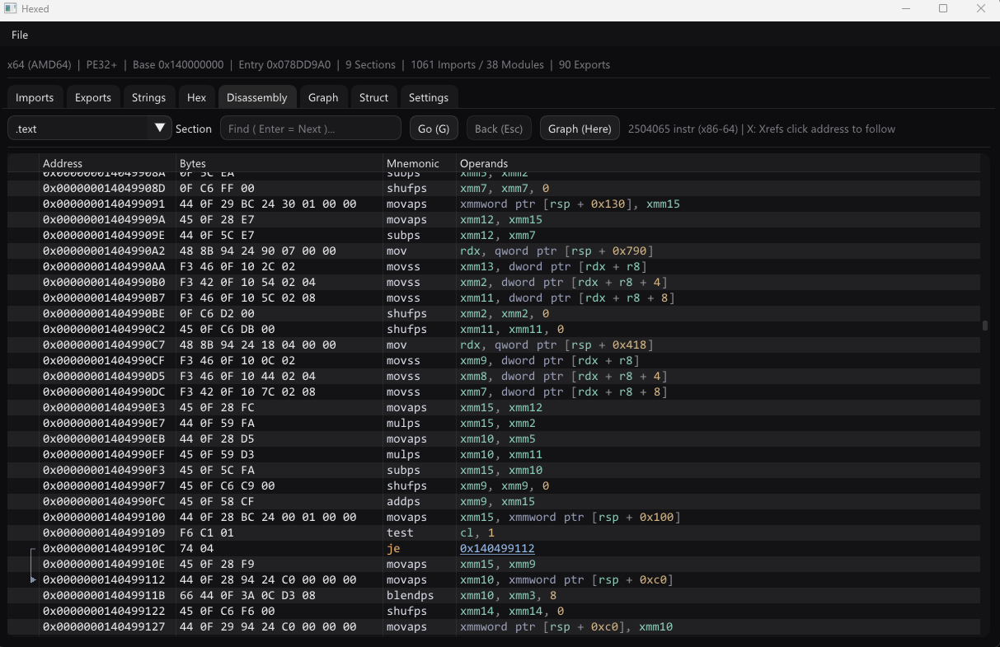
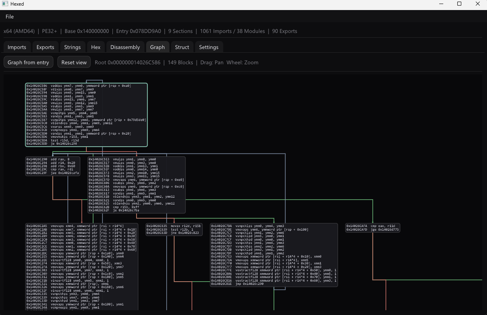

# hexed

> A Windows hex editor and PE binary inspector in modern C++ — disassembler, control-flow graphs, imports/exports, multi-encoding strings, and structure overlays in one cohesive, monochrome interface.


`hexed` is a from-scratch reverse-engineering toolkit built on [Dear ImGui](https://github.com/ocornut/imgui) with a DirectX 11 backend. It parses PE files, disassembles x86 / x86-64 with [Capstone](https://www.capstone-engine.org/), reconstructs control-flow graphs, and offers interactive navigation — follow references, list cross-refs, jump anywhere — behind a single simple UI.

## Screenshots

| Disassembly | Control-flow graph |
| --- | --- |
|  |  |

## Features

### Binary analysis
- **Imports** — every imported module (DLL) and the functions pulled from it, by name or ordinal, in a filterable tree. The parser is fully bounds-checked and safe on malformed / untrusted input.
- **Exports** — exported functions with ordinal, RVA, and name; forwarded exports are resolved (e.g. `AcquireSRWLockExclusive -> NTDLL.RtlAcquireSRWLockExclusive`). Double-click to view an export in the disassembly.
- **Strings** — scans for printable strings in multiple encodings (strict 7-bit ASCII, C-style, UTF-16, UTF-32) with a live search, per-encoding toggles, and a configurable minimum length. Double-click to jump to the hex view, or press **X** to find where a string is referenced in code.
- **Struct** — overlay a sequence of typed fields (`int8`…`int64`, `float`, `double`, `char[]`, `bytes[]`) onto the bytes at a base offset and read off each parsed value — a lightweight structure-template / data inspector.

### Disassembly & control flow
- **Disassembly** — x86 / x86-64 listing powered by Capstone in detail mode, so branch and RIP-relative references resolve to absolute addresses. Syntax-highlighted mnemonics / registers / immediates, jump arrows in a left gutter, and inline `; "..."` string annotations. Navigation:
  - **Click** any call/jump target in an operand to follow it
  - **G** — go to an arbitrary address · **X** — list cross-references · **Esc** — back through jump history
  - **Find** — incremental text search over the listing
  - **Graph (here)** — open the selected function as a control-flow graph
- **Control-flow graph** — basic-block boxes laid out in breadth-first layers, with right-angle flow edges colored by kind (unconditional / conditional-taken / fall-through). Pan by dragging, zoom with the wheel.

### Hex editing
- **Hex / ASCII view** — monospace address / hex / ASCII columns; only visible rows are rendered each frame (`ImGuiListClipper`), so multi-gigabyte files scroll smoothly.
- **Pattern search** — byte patterns with wildcards (e.g. `48 89 ?? 5C`) or text, highlighted in place with jump-to-match.
- **Go-to offset**, adjustable 4–64 bytes per row.

### Interface
- **Tabbed workspace** under a one-line PE summary header (arch, format, image base, entry, section / import / export counts).
- **Drag & drop** any file onto the window, or open via `Ctrl+O`.
- **Settings** — rebind shortcuts, choose UI / monospace fonts and sizes (the font atlas is rebuilt live), and edit the full theme (colors, rounding, spacing).
- **Named configurations** — save / load / delete keybinds + fonts + theme on disk; the last one is restored on startup.

## Building

Requirements: Windows, CMake ≥ 3.16, and an MSVC toolchain (Visual Studio 2019/2022 or Build Tools).

```sh
git clone --recursive https://github.com/xsslize/hexed.git
cd hexed

# If you forgot --recursive:
git submodule update --init --recursive

cmake -B build
cmake --build build --config Release
```

## Architecture

The platform / render layer is deliberately thin and isolated from editor logic — `main.cpp` knows nothing about hex editing, so swapping the backend (e.g. to OpenGL/GLFW for cross-platform) only touches that file.

```
src/
├── main.cpp                 # Win32 window + DX11 device + frame loop only
├── app/app.*                # Menu bar, file dialog, summary header, tab layout
├── core/
│   ├── file-buffer.*        # File I/O and byte storage
│   └── settings.*           # Global config + named on-disk configurations
├── analysis/
│   ├── pe-parser.*          # Bounds-safe PE header / import / export / section parser
│   ├── string-scanner.*     # Multi-encoding printable-string scanner
│   ├── disassembler.*       # Capstone x86 / x86-64 wrapper (resolved references)
│   └── control-flow-graph.* # Basic-block / CFG builder
└── ui/
    ├── hex-view.*           # Hex widget: clipped rendering + pattern search
    ├── imports-panel.*      # Imports tab
    ├── exports-panel.*      # Exports tab
    ├── strings-panel.*      # Strings tab: scan, search, jump-to-offset
    ├── disassembly-panel.*  # Disassembly tab: listing + navigation + annotations
    ├── graph-panel.*        # Graph tab: CFG layout + pan/zoom canvas
    ├── struct-panel.*       # Struct tab: typed-field overlay
    ├── settings-panel.*     # Settings tab: configs, keybinds, fonts, theme editor
    └── theme.*              # Style + font loading
```

## Tech & code style

C++17 · Dear ImGui (v1.91.5) · Capstone (5.0.9) · DirectX 11 · Win32 · CMake · MSVC

See [`.clang-format`](.clang-format).

## License

MIT — see [LICENSE](LICENSE).
